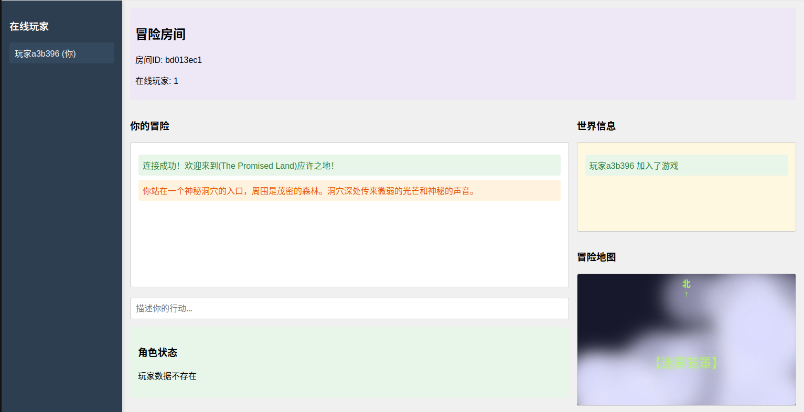

# AI Dungeon Game - 应许之地

一个基于 AI 技术的多人在线文字冒险游戏，玩家可以在虚拟世界中探索、战斗、收集装备，体验沉浸式的 RPG 游戏体验。

## 🎮 游戏特色

- **多人在线游戏**：支持多玩家同时在线，实时互动
- **AI 驱动剧情**：使用大语言模型生成动态游戏剧情
- **角色成长系统**：完整的属性、装备、天赋系统
- **实时地图系统**：动态生成的 ASCII 地图，支持迷雾效果
- **WebSocket 通信**：低延迟的实时游戏体验

## 🛠️ 技术栈

### 后端技术

- **FastAPI** - 现代、高性能的 Python Web 框架
- **WebSocket** - 实时双向通信
- **SQLite** - 轻量级数据库，存储玩家数据和游戏状态
- **asyncio** - 异步编程支持
- **aiohttp** - 异步 HTTP 客户端

### 前端技术

- **HTML5** - 现代网页结构
- **CSS3** - 响应式设计和动画效果
- **JavaScript (ES6+)** - 客户端逻辑和 WebSocket 通信
- **WebSocket API** - 实时通信

### AI 技术

- **DeepSeek API** - 大语言模型，用于生成游戏剧情和响应
- **词向量技术** - TF-IDF 向量化，用于剧情相似度匹配
- **RAG (检索增强生成)** - 基于剧情数据库的智能内容生成
- **自然语言处理** - 解析玩家输入，生成游戏响应

## 🚀 快速开始

### 环境要求

- Python 3.8+
- Node.js (可选，用于前端开发)

### 安装依赖

```bash
pip install -r requirements.txt
```

### 配置环境变量

创建 `.env` 文件并配置以下变量：

```env
DEEPSEEK_API_KEY=your_deepseek_api_key
DEEPSEEK_API_BASE=https://api.deepseek.com
AI_MAX_TOKENS=200
AI_TEMPERATURE=0.7
```

### 启动服务

```bash
python advanture.py
```

或者使用 uvicorn：

```bash
uvicorn main:app --host 0.0.0.0 --port 8000 --reload
```

### 访问游戏

打开浏览器访问：`http://localhost:8000`

## 🎯 游戏玩法

1. **创建角色**：进入游戏后自动创建角色
2. **探索世界**：在洞穴中探险，发现宝藏和危险
3. **战斗系统**：与怪物战斗，使用武器和技能
4. **装备收集**：获得各种武器和装备
5. **角色成长**：提升等级，学习新技能
6. **多人协作**：与其他玩家一起冒险

## 🏗️ 项目结构

```
AI_game/
├── config/
│   └── settings.py          # 配置管理
├── services/
│   ├── ai_service.py        # AI 服务
│   ├── db_service.py        # 数据库服务
│   ├── llm_db_service.py    # LLM 数据库集成服务
│   ├── map_service.py       # 地图服务
│   └── room_manager.py      # 房间管理
├── routers/
│   └── ws_connection.py     # WebSocket 路由
├── static/
│   ├── index.html           # 主页面
│   ├── styles.css           # 样式文件
│   ├── game.js              # 游戏逻辑
│   ├── fog_effect.js        # 迷雾效果
│   └── fog_effect.css       # 迷雾样式
├── data/
│   └── game.db              # SQLite 数据库
├── main.py                  # 应用入口
└── requirements.txt         # 依赖列表
```

## 🤖 AI 技术详解

### 大语言模型集成

- 使用 DeepSeek API 生成游戏剧情
- 支持中文对话和描述
- 动态调整游戏难度和剧情走向

### 智能剧情生成

- 基于玩家当前状态生成个性化剧情
- 考虑玩家装备、属性、当前阶段
- 支持多种游戏场景和事件

### 数据库集成

- AI 可以直接读取和修改玩家数据
- 支持装备耐久度、生命值等动态更新
- 智能的物品掉落和奖励系统

## 🎨 界面特色

- **响应式设计**：适配不同屏幕尺寸
- **实时更新**：玩家状态、地图、消息实时同步
- **迷雾效果**：动态的视觉特效
- **ASCII 地图**：复古风格的游戏地图
- **滚动聊天**：支持大量消息的流畅滚动

## 🔧 开发说明

### 添加新的游戏内容

1. 在 `services/db_service.py` 中添加新的数据表
2. 在 `services/llm_db_service.py` 中更新 AI 提示
3. 在前端添加相应的 UI 组件

### 自定义 AI 行为

修改 `services/ai_service.py` 中的提示模板，调整 AI 的响应风格和行为模式。

### 扩展地图系统

在 `services/map_service.py` 中添加新的地图生成逻辑，支持更复杂的地图结构。

## 📝 API 文档

### WebSocket 消息格式

#### 客户端发送

```json
{
  "type": "action",
  "content": "玩家行动描述"
}
```

#### 服务端响应

```json
{
  "type": "ai_response",
  "content": "AI 生成的游戏响应"
}
```

## 🤝 贡献指南

1. Fork 项目
2. 创建功能分支 (`git checkout -b feature/AmazingFeature`)
3. 提交更改 (`git commit -m 'Add some AmazingFeature'`)
4. 推送到分支 (`git push origin feature/AmazingFeature`)
5. 打开 Pull Request

## 📄 许可证

本项目采用 MIT 许可证 - 查看 [LICENSE](LICENSE) 文件了解详情

## 🙏 致谢

- DeepSeek 提供的大语言模型 API
- FastAPI 框架的开发者
- 所有贡献者和测试用户

## 📞 联系方式

如有问题或建议，请通过以下方式联系：

- 提交 Issue
- 发送邮件至：[henrypotterheng@gmail.com]

---

**享受你的 AI 冒险之旅！** 🎮✨
